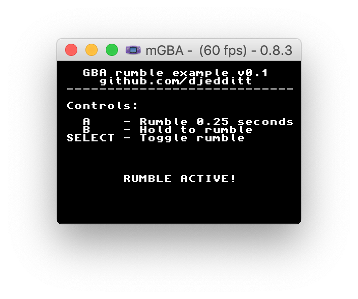

# GBA rumble example
This repository contains a mini library with a set of simple functions that can be used to add rumble to your homebrew GBA game (see example). It has been tested and verified to work on real hardware using [insideGadget's](https://shop.insidegadgets.com/product/gba-32mb-256kbit-fram-save-flash-cart/)  32MB, 256Kbit FRAM flash cart with rumble motor.

Included is both the source code and ROM binary. Enjoy!

## License
This work is licensed under the MIT License. See [LICENSE](https://raw.githubusercontent.com/djedditt/gba-rumble-example/master/LICENSE) for details.